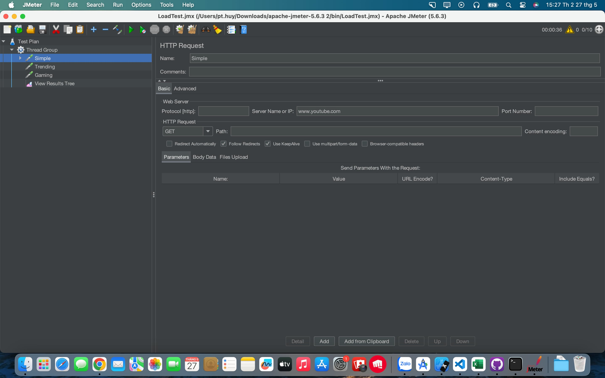
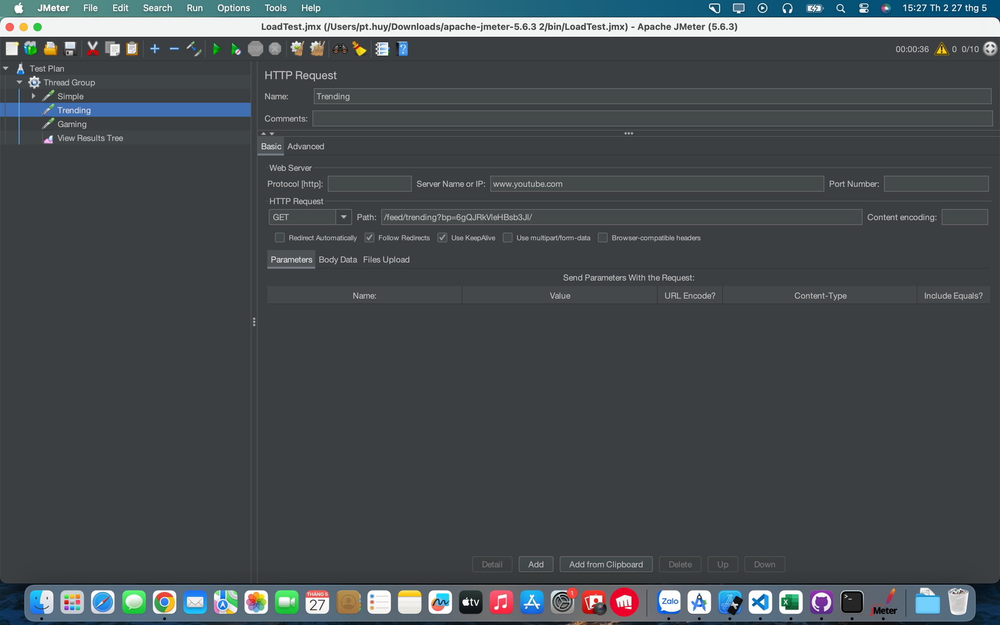
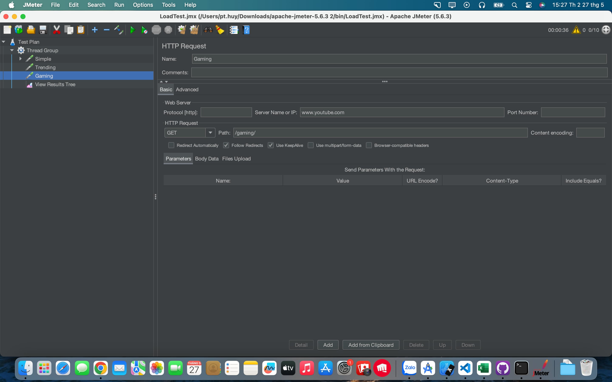
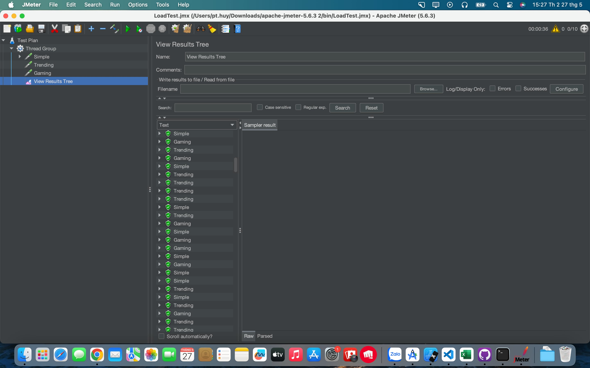

# JMeter

# Lựa chọn trang web để thực hành

- Trang web được lựa chọn sẽ là: https://www.youtube.com/

# Thêm một HTTP Request Sampler

- Thêm 2 trang web khác bao gồm:
  - Trang web thứ nhất: https://www.youtube.com/feed/trending?bp=6gQJRkVleHBsb3Jl
  
  - Trang web thứ hai: https://www.youtube.com/gaming
  

# Thêm một Listener để ghi lại kết quả

- Kết quả khi chạy:

